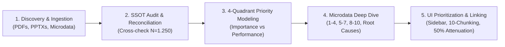

# Survey Analytics, Priority Matrices, and Information Presentation Skill

This skill packages battle-tested workflows, statistical methodologies, and UI/UX design patterns for:
1. **Multisource Detection & Data Ingestion**: Auditing raw datasets vs. executive summaries, extracting ultra-HD visual crops from PDF/PPTX reports, and establishing a single source of truth (SSOT).
2. **Advanced Statistical Cross-Tabulation & Priority Modeling**: Decomposing ordinal/Likert ratings (negative/neutral/positive/mean), building Importance-Performance Analysis (IPA / CIER 4-Quadrant Matrices), and uncovering operational root causes.
3. **Information Prioritization & Interactive Visualization**: Structuring sidebar navigations, 10-item cognitive chunking, bidirectional Chart.js scatter-to-card filtering, 50% focus attenuation, non-glare matte alert palettes, and full-screen zoom modals.

---

## 🧭 Core Workflow Phases

---

## 🛠️ Step-by-Step Procedures

### Phase 1: Information Detection & Ingestion
1. **Discover Raw vs. Processed Assets:**
   - Locate official PDF reports, presentation decks (PPTX), and raw tabular survey dumps (Excel, CSV, SPSS).
   - Use `extract_pdf_crop_hd.py` with PyMuPDF (`fitz`) to crop vector graphics, priority matrices, and benchmark charts at $\ge 300\text{ DPI}$ (zoom matrix 2.0x-3.0x).
2. **Reconcile SSOT:**
   - Cross-check executive summary figures (e.g. general satisfaction indexes, sub-indices) against microdata computations ($N$).
   - Follow the [Detection & SSOT Protocol Reference](./references/detection_and_ssot_protocol.md) for discrepancy detection and variable codebook mapping.

### Phase 2: Statistical Analysis & Priority Matrix Construction
1. **Importance-Performance Analysis (IPA / Matriz de Acciones de Mejora):**
   - Extract Relative Importance ($X$-axis, % o coeficientes de correlación/regresión) and Performance/Satisfaction ($Y$-axis, escala 0-100 o 1-10).
   - Establish methodological cutoffs (e.g., CIER standard: average importance $3.33\%$, baseline performance $64.8\text{ pts}$).
   - Classify all evaluated attributes into the 4 strategic quadrants:
     - **Cuadrante I (Foco Urgente / Prioridad 1):** Alta Importancia, Bajo Desempeño.
     - **Cuadrante II (Fortalezas Clave / Mantener):** Alta Importancia, Alto Desempeño.
     - **Cuadrante III (Ventajas Secundarias / Eficiencia):** Baja Importancia, Alto Desempeño.
     - **Cuadrante IV (Baja Prioridad / Monitoreo):** Baja Importancia, Bajo Desempeño.
2. **Microdata Cross-Tabulation per Attribute:**
   - Calculate rating breakdown: % Negativas (1-4), % Neutras (5-7), % Positivas (8-10), and Nota Media (/10).
   - Cross-tabulate with operational friction logs (outage duration, billing disputes, customer service wait times) to identify actionable root causes.
   - Follow the [Quadrant Matrix Methodology Guide](./references/quadrant_matrix_methodology.md).

### Phase 3: Information Presentation & UI Prioritization
1. **Navigation Architecture:**
   - Replace cluttered horizontal tabs with a dedicated **Sidebar Navigation** (grouped by macro categories with dynamic badge counters and topbar breadcrumbs).
2. **Cognitive Chunking (10 Items per Page):**
   - In dense multi-attribute lists (e.g., 30 CIER attributes), implement a pagination bar with 10-item chunks (**Puestos 1-10**, **Puestos 11-20**, **Puestos 21-30**, and **Ver Todos**) along with quadrant and search filters.
3. **Bidirectional Scatter Plot ↔ Microdata Reactivity:**
   - Configure Chart.js scatter plots with click handlers:
     - Clicking a point highlights it in a high-contrast accent color (e.g. bright cyan `#06b6d4`, radius 13px, white stroke).
     - **50% Attenuation:** Dim non-selected points to 50% opacity (`rgba(..., 0.5)` or border alpha) so context is preserved without visual noise.
     - Automatically filter and scroll to the corresponding microdata card and highlight table rows.
   - Display an active selection banner with single-click reset and multi-select capability.
4. **Contrast & Alert Styling:**
   - For critical warning cards (e.g. Detractor Profiles, SLA alerts), use matte dark solid backgrounds (e.g. `#240e11` with `#ef4444` border) with zero glossy gradient reflections to ensure crisp readability.
5. **Full-Screen HD Zoom Modal:**
   - Provide clickable modal expansion for technical chart crops to enable instant visual audit against official publications.
   - Follow the [UI Prioritization Patterns Guide](./references/ui_prioritization_patterns.md).

---

## 📂 Reference Guides & Helper Scripts

- [Detection & SSOT Protocol](./references/detection_and_ssot_protocol.md)
- [Quadrant Matrix Methodology](./references/quadrant_matrix_methodology.md)
- [UI Prioritization Patterns](./references/ui_prioritization_patterns.md)
- [extract_pdf_crop_hd.py](./scripts/extract_pdf_crop_hd.py)
- [calculate_quadrants_and_microdata.py](./scripts/calculate_quadrants_and_microdata.py)
